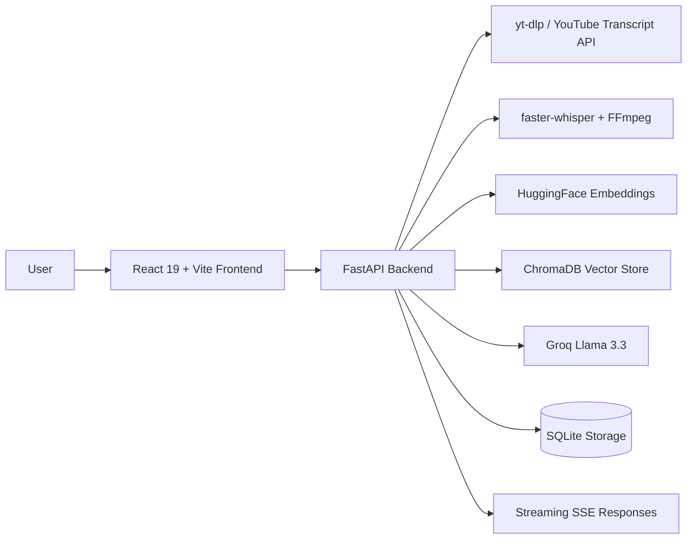

# YoutuLearn AI

Learn Anything from YouTube with AI.

YoutuLearn AI is a production-oriented learning platform that turns YouTube videos into searchable, retrievable study material. Users can ingest a video, build embeddings, chat with timestamped citations, generate summaries, quizzes, flashcards, notes, and study plans, and continue prior conversations across collections.

## Architecture



## Tech Stack

Frontend:

- React 19
- TypeScript
- Vite
- Tailwind CSS
- Framer Motion
- React Router
- Axios
- React Markdown
- TanStack Query
- Lucide Icons

Backend:

- Python 3.12
- FastAPI
- LangChain
- ChromaDB
- Groq API
- HuggingFace embeddings (`BAAI/bge-small-en-v1.5`)
- yt-dlp
- faster-whisper
- FFmpeg
- Pydantic
- Uvicorn

Optional infrastructure:

- Redis caching
- Docker
- Docker Compose

## Features

- Paste a YouTube URL and process it into a transcript-backed knowledge base
- Timestamped RAG chat with confidence scoring and source snippets
- Streaming answers over Server-Sent Events
- Transcript search with semantic retrieval
- Video summaries in multiple styles
- Quiz generation, flashcards, notes, and interview prep
- Multi-video collections and study mode
- Conversation history, bookmarks, and dashboard metrics
- Responsive dark-mode UI with glassmorphism styling

## Folder Structure

```text
backend/
  app/
    api/
    core/
    models/
    prompts/
    services/
    utils/
    main.py
  requirements.txt

frontend/
  src/
    components/
    contexts/
    hooks/
    lib/
    pages/
    services/
    styles/
    types/
```

## Installation

### Backend

```bash
cd backend
python -m venv .venv
.venv\Scripts\activate
pip install -r requirements.txt
uvicorn app.main:app --reload --port 8000
```

### Frontend

```bash
cd frontend
npm install
npm run dev
```

## Environment Variables

Copy `.env.example` to `.env` and set:

- `GROQ_API_KEY`
- `GROQ_MODEL`
- `HF_EMBEDDING_MODEL`
- `CHROMA_PATH`
- `DATA_DIR`
- `CORS_ORIGINS`
- `VITE_API_BASE_URL` in the frontend if the backend is not running at `http://localhost:8000`

## API Documentation

Available routes:

- `POST /process-video`
- `POST /chat`
- `POST /summary`
- `POST /quiz`
- `POST /flashcards`
- `POST /notes`
- `POST /study`
- `GET /transcript/{video_id}`
- `GET /search`
- `GET /history`
- `GET /collections`
- `GET /videos`
- `GET /stats`

FastAPI also exposes interactive docs at `/docs` and `/redoc`.

## Screenshots

Replace these placeholders with product screenshots after running the app:

- Home page
- Video workspace
- Transcript search
- Dashboard
- Collections and history

## Docker

```bash
docker compose up --build
```

## Future Improvements

- User authentication and team workspaces
- Background job queue for long-running transcription jobs
- PDF export for notes and quizzes
- Per-user bookmark syncing and analytics
- Source-level caching for repeated semantic queries
- Full multi-tenant collection sharing
